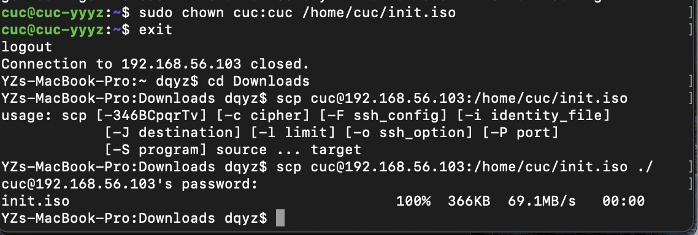
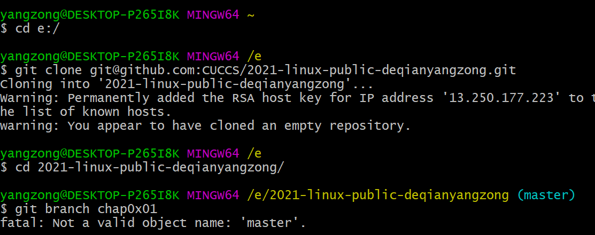

# Chap0x01  无人值守Linux安装镜像制作

## 软件环境

- ubuntu-20.04.2-live-server-amd64.iso
- VirtualBox 6.1.18
- macOS Big Sur 11.2.2

## 实验Q&A

### 如何配置无人值守安装iso并在Virtualbox中完成自动化安装？


1. 下载 `Ubuntu` 安装镜像` iso `文件，手动安装 `Ubuntu `

   > **若出现错误 `The VM session was aborted.`则需添加`IDE`**

   

   > **开始安装，按回车键进行下一步**

   

   > **关键步骤**：按空格键添加`SSH`

   

   > **手动安装` Ubuntu` 完成**

   
   
   
   
2. 获取初始自动配置描述文件 `autoinstall-user-data`

   ```shell
   # 获取虚拟机的IP地址
   ip a
   
   # 连接到虚拟机
   ssh cuc@192.168.56.103
   
   # 授权
   sudo chown cuc:cuc /var/log/installer/autoinstall-user-data
   
   # 退出虚拟机连接
   exit
   
   # 转到下载目录
   cd Downloads
   
   # 下载到本地
   scp cuc@192.168.56.103:/var/log/installer/autoinstall-user-data ./
   ```

   > **获取`IP`地址**

   
   
   > **将文件下载到主机**

   

   > **下载后的文件与示例文件对比**

   
   
   > **得到可用配置文件 `user-data`**
   
   
   
   
   
3. 制作 `focal-init.iso` 镜像文件

   ```shell
   # 使用 sftp 连接到虚拟机
   sftp cuc@192.168.56.103
   
   # 将主机中的文件上传至虚拟机
   # 上传 user-data
   put /Users/dqyz/Desktop/user-data
   
   # 上传 meta-data
   put /Users/dqyz/Desktop/meta-data
   
   # 使用 pwd 查看文件保存路径
   pwd
   
   # 退出sftp
   exit
   
   # 使用SSH连接虚拟机
   ssh cuc@192.168.56.103
   
   # 安装依赖工具——Ubuntu
   sudo apt install genisoimage
   
   # 创建 cloud-init 镜像
   genisoimage -output init.iso -volid cidata -joliet -rock user-data meta-data
   
   # 配置网卡
   genisoimage -output init.iso -volid cidata -joliet -rock user-data meta-data network-config
   
   # 使用 pwd 查看镜像保存路径
   pwd 
   
   # 授权
   sudo chown cuc:cuc /home/cuc/init.iso
   
   # 退出虚拟机连接
   exit
   
   # 转到下载目录
   cd Downloads
   
   # 下载到本地
   scp cuc@192.168.56.103:/home/cuc/init.iso ./
   
   ```

   >**使用 `sftp` 上传文件到虚拟机**

   

   > **在虚拟机里创建镜像**

   

   > **将镜像下载到主机**

   

   

4. 新建虚拟机，安装无人值守镜像

   - 重命名镜像为命名为 `focal-init.iso`
   - 移除虚拟机`控制器IDE`
   - 在`控制器SATA`下新建 2 个虚拟光盘
   - **按顺序** 先挂载`Ubuntu 安装镜像文件`后挂载 `focal-init.iso`
   - 启动虚拟机
   - 出现提示信息时，输入`yes`，开始无人值守安装

   > Continue with autoinstall? (yes|no)

   - 成功安装

   > **新建虚拟光盘**
   
   
   
   > **虚拟机存储与网络设置**
   
   
   
   > **出现提示信息，输入`yes`**
   
   

   > **完成安装**
   
   


### Virtualbox安装完Ubuntu之后新添加的网卡如何实现系统开机自动启用和自动获取IP？

    ubuntu20.04添加新网卡后设置自动启用并获取ip


### 如何使用sftp在虚拟机和宿主机之间传输文件？

- 打开终端，连接远程Linux 

  `sftp user@host`

- 上传文件

  `put local_path remote_path`

- 创建文件夹 

  `put -r /home/share/folder/* /home/root/folder`

- 下载文件 

  `get remote_path local_path` 

- 退出 

  `exit`

[使用sftp在Linux（MacOS）之间进行文件传输](https://blog.csdn.net/qq_26954773/article/details/78199365)


## 遇到的问题及解决方案

- 不知道怎样查看文件在虚拟机内的保存路径

  看到助教师姐的回复知道可以用 `pwd`

  [语雀讨论区](https://www.yuque.com/c4pr1c3/linux/ttkz7y)

- 对于如何制作镜像不明确

  [Ubuntu 20.04  Autoinstall ](https://gist.github.com/bitsandbooks/6e73ec61a44d9e17e1c21b3b8a0a9d4c)

- 对于制作镜像过程中，实际在虚拟机内输入的指令不明确

  [cloud-init 配置文件和相关说明](https://github.com/c4pr1c3/LinuxSysAdmin/blob/4c7cdacd36757f2bd1ba3b56f6514c7fc1585c8b/exp/cloud-init/docker-compose/README.md)

- 对于实验整体的把握，**实验指南**提供了莫大帮助

  [实验指南](https://github.com/c4pr1c3/LinuxSysAdmin/blob/4c7cdacd36757f2bd1ba3b56f6514c7fc1585c8b/chap0x01.exp.md)

- Git操作出现问题
  
  `git@github.com: Permission denied (publickey). Could not read from remote repository`
 
  原因：Git与Github没有使用同一个邮箱
  
  解决方法：需要重新修改邮箱，建立SSH连接，打开
  `.ssh/id_rsa.pub`
   > **新建`SSH`,建立`Git`与`Github`的连接**

  
- Git新建分支出现错误
  
  `fatal: Not a valid object name: 'master'`
  
  原因：刚创建的git仓库默认的master分支要在第一次commit之后才会真正建立，现在没有提交一个对象，要先`commit`之后才会真正建立`master`分支，此时才可以建立其它分支
   > **没有`master`分支，无法建立`branch`**


- Git Bash出现错误
  
  `fatal: pathspec ‘master.txt’ did not match any files`
 
  解决方法：需要初始化仓库，自己创建`.txt`文件是没有用的，必须在`bash`里`touch`，然后`git add` , 然后`commit` ，就可以有`master`分支,从而可以建立其他分支   
   > **建立`master`分支，建立`chap0x01`分支**


## 参考文献

- [使用sftp在Linux（MacOS）之间进行文件传输](https://blog.csdn.net/qq_26954773/article/details/78199365)
  
- [实验指南](https://github.com/c4pr1c3/LinuxSysAdmin/blob/4c7cdacd36757f2bd1ba3b56f6514c7fc1585c8b/chap0x01.exp.md)
  
- [cloud-init 配置文件和相关说明](https://github.com/c4pr1c3/LinuxSysAdmin/blob/4c7cdacd36757f2bd1ba3b56f6514c7fc1585c8b/exp/cloud-init/docker-compose/README.md)
  
- [Ubuntu 20.04  Autoinstall ](https://gist.github.com/bitsandbooks/6e73ec61a44d9e17e1c21b3b8a0a9d4c)
  
- [语雀讨论区](https://www.yuque.com/c4pr1c3/linux/ttkz7y)
  
- [解决git@github.com: Permission denied (publickey). Could not read from remote repository](https://blog.csdn.net/ywl470812087/article/details/104459288?ops_request_misc=%257B%2522request%255Fid%2522%253A%2522161571613816780261981480%2522%252C%2522scm%2522%253A%252220140713.130102334..%2522%257D&request_id=161571613816780261981480&biz_id=0&utm_medium=distribute.pc_search_result.none-task-blog-2~all~sobaiduend~default-4-104459288.first_rank_v2_pc_rank_v29&utm_term=git%40github.com%3A+Permission+denied+%28publickey%29.y)
  
- [Git使用出现git@github.com: Permission denied (publickey). 处理](https://blog.csdn.net/qq_43768946/article/details/90411154?ops_request_misc=%257B%2522request%255Fid%2522%253A%2522161571613816780261981480%2522%252C%2522scm%2522%253A%252220140713.130102334..%2522%257D&request_id=161571613816780261981480&biz_id=0&utm_medium=distribute.pc_search_result.none-task-blog-2~all~sobaiduend~default-1-90411154.first_rank_v2_pc_rank_v29&utm_term=git%40github.com%3A+Permission+denied+%28publickey%29.)

- [git 错误 fatal: Not a valid object name: 'master'(示例代码)](https://www.yuque.com/c4pr1c3/linux/ttkz7y)

- [stackoverflow：fatal: Not a valid object name: 'master'](https://stackoverflow.com/questions/9162271/fatal-not-a-valid-object-name-master)

- [pathspec XXX did not match any files](https://support.huaweicloud.com/codehub_faq/codehub_faq_1005.html)

- [fatal: pathspec 'readme.txt' did not match any files 解决办法](https://blog.csdn.net/qq_37855074/article/details/90181162)


