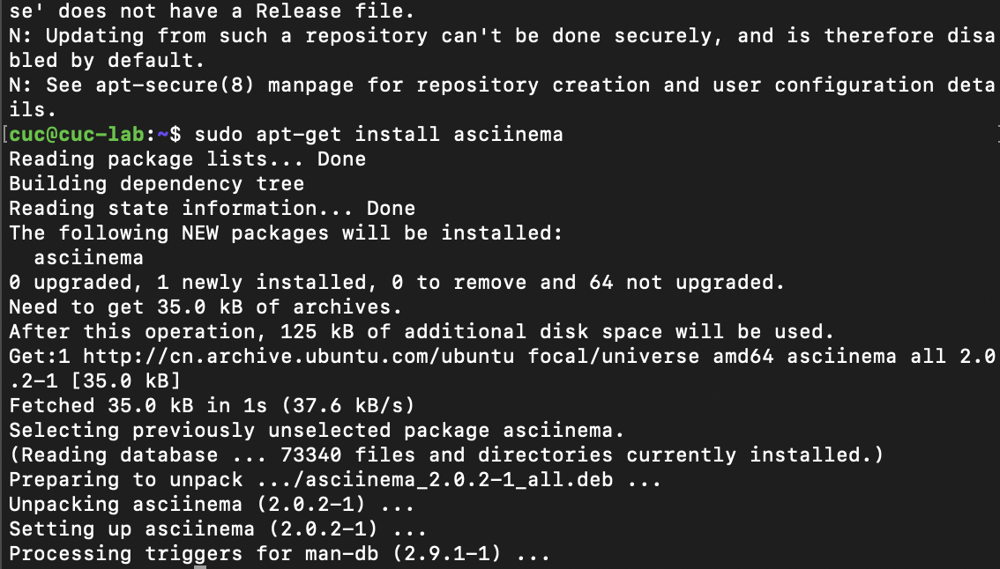
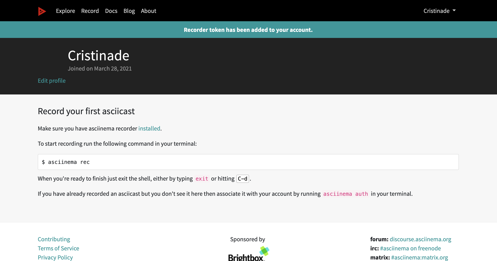

# Chap0x02  Vimtutor的学习

## 软件环境

- ubuntu-20.04.2-live-server-amd64.iso
- VirtualBox 6.1.18
- macOS Big Sur 11.2.2

## 实验要求 
1. 确保本地已经完成asciinema auth，并在asciinema成功关联了本地账号和在线账号
2. 上传本人亲自动手完成的vimtutor操作全程录像
3. 在自己的github仓库上新建markdown格式纯文本文件附上asciinema的分享URL
4. **避免在终端操作录像过程中暴漏密码、个人隐私等任何机密数据**

## Vimtutor学习过程

### 前期准备

- 打开`asciinema`官网，注册账号, 验证邮箱

  [asciinema官网](https://asciinema.org/docs)

- 打开`installation`页面，选择`Ubuntu`安装指令

  [Ubuntu的acsiinema安装指令](https://asciinema.org/docs/installation)

   ```shell

   sudo apt-add-repository ppa:zanchey/asciinema
   sudo apt-get update
   sudo apt-get install asciinema

   ```
  

- 输入`asciinema auth`，在`asciinema`成功关联了本地账号和在线账号

  

### vimtutor学习过程录像

#### A Brief Introduction
- vimtutor : A Brief Introduction

 [](https://asciinema.org/a/lTIWemuHEnBkb3ngEU6zRwBSs)

#### Lesson 1
- vimtutor : Lesson 1.1_ MOVING THE CURSOR

 [](https://asciinema.org/a/r2mW87ZoycHyo6JVtsAbwYLdw)

- vimtutor : Lesson 1.2_ EXITING VIM

 [](https://asciinema.org/a/9secuvh7nWEitXzQISIsFnbXd)

- vimtutor : Lesson 1.3_TEXT EDITING - DELETION

 [](https://asciinema.org/a/8rgGqNP6Bh913nT9KKCMuArwN)

- vimtutor : Lesson 1.4_TEXT EDITING - INSERTION

 [](https://asciinema.org/a/lYC56LJE7qDFex3Ymdc0aJccf)

- vimtutor : Lesson 1.5_TEXT EDITING - APPENDING

 [](https://asciinema.org/a/gEWzFYu6nMNoanvvzZKIwx9ru)

- vimtutor : Lesson 1.6_EDITING A FILE

 [](https://asciinema.org/a/jGnvYt7eq4L3KT9UxAgRlJG2S)

- vimtutor : Lesson 1 SUMMARY

 [](https://asciinema.org/a/yrVTQBNZqosZaom6t7MyIxjbE)

#### Lesson 2

 - vimtutor : Lesson 2.1_ DELETION COMMANDS

 [](https://asciinema.org/a/oai0cCT1B1TtW0kRNS545e5IX)

- vimtutor : Lesson 2.2_MORE DELETION COMMANDS

 [](https://asciinema.org/a/zOXu5p4oxsuet66hNfHAvAPiV)

- vimtutor : Lesson 2.3_ON OPERATORS AND MOTIONS

 [](https://asciinema.org/a/0Gk4dTKRO3eY53rMV14f3Hf81)

- vimtutor : Lesson 2.4_USING A COUNT FOR A MOTION

 [](https://asciinema.org/a/s420UWCR2uuoigPbd3bgNWOtN)

- vimtutor : Lesson 2.5_USING A COUNT TO DELETE MORE

 [](https://asciinema.org/a/9HHSWcCk82e4dennIwqdWal8F)

- vimtutor : Lesson 2.6_OPERATING ON LINES

 [](https://asciinema.org/a/O7HptMYPEcIx6GXz3tyFcFHss)

- vimtutor : Lesson 2.7_THE UNDO COMMAND

 [](https://asciinema.org/a/qyn8YfIM5mUwu2nmXkPCeDzo7)

 - vimtutor : Lesson 2 SUMMARY

 [](https://asciinema.org/a/E6kjpAH6oV2JNXvWAdHiGORnf)

#### Lesson 3

- vimtutor : Lesson 3.1_THE PUT COMMAND

 [](https://asciinema.org/a/NxjqsvinxwbhPwJtBMXwx6Xjw)

- vimtutor : Lesson 3.2_THE REPLACE COMMAND

 [](https://asciinema.org/a/SKbqCkOMrb7UaSPQjhmwr9Lk5)

- vimtutor : Lesson 3.3_ THE CHANGE OPERATOR

 [](https://asciinema.org/a/zcLIRwaEluBBeKuk20nvn5lXj)

- vimtutor : Lesson 3.4_ MORE CHANGES USING c

 [](https://asciinema.org/a/TOSWJUIOWsPrfYAYMedbH5UkY)

- vimtutor : Lesson 3 SUMMARY

 [](https://asciinema.org/a/OImfZnOOPIHhu9ZnKJnKdah93)

#### Lesson 4

- vimtutor : Lesson 4.1_CURSOR LOCATION AND FILE STATUS

 [](https://asciinema.org/a/GcnoWyEYraNwOZCpu6YRCXlCO)

- vimtutor : Lesson 4.2_ THE SEARCH COMMAND

 [](https://asciinema.org/a/UXFTI4pBnY8zXLGjwrKVnzwxW)

- vimtutor : Lesson 4.3_MATCHING PARENTHESES SEARCH

 [](https://asciinema.org/a/r0X6bmajIGaVdKJtMDnZluDAp)

 - vimtutor : Lesson 4.4_THE SUBSTITUTE COMMAND

 [](https://asciinema.org/a/T5YESahEF44PDvdpOWSRvJqPQ)

- vimtutor : Lesson 4 SUMMARY

 [](https://asciinema.org/a/Mw2oxd4OjIVLjI1473y4vnq0G)

#### Lesson 5

- vimtutor : Lesson 5.1_ HOW TO EXECUTE AN EXTERNAL COMMAND

 [](https://asciinema.org/a/3nXgwtYRcQJoqH2hU6Dwiv9Tu)

- vimtutor : Lesson 5.2_ MORE ON WRITING FILES

 [](https://asciinema.org/a/EAwGRHj8qC7HcWrBdLXeC3DmZ)

- vimtutor : Lesson 5.3_ SELECTING TEXT TO WRITE

 [](https://asciinema.org/a/XmTk3Z4fN7tPxUOqmcqPar631)

- vimtutor : Lesson 5.4_RETRIEVING AND MERGING FILES

 [](https://asciinema.org/a/Ro1jihLiB6aONBsMJ4kDyulQJ)

- vimtutor : Lesson 5 SUMMARY

 [](https://asciinema.org/a/TG5UrAHxoJDffmDysWqtGlJNr)

#### Lesson 6

- vimtutor : Lesson 6.1_ THE OPEN COMMAND

 [](https://asciinema.org/a/oLWIHX2F8ssKGtpk2a0v5INkI)

- vimtutor : Lesson 6.2_THE APPEND COMMAND

 [](https://asciinema.org/a/iGitCLV0QtbWmbx5ZjeW803md)

- vimtutor : Lesson 6.3_ ANOTHER WAY TO REPLACE

 [](https://asciinema.org/a/ATg9e9EDLnAJppfBRgm3cTq5B)

- vimtutor : Lesson 6.4_ COPY AND PASTE TEXT

 [](https://asciinema.org/a/pYPmYzTlaJ81brekRrYvVgpRK)

- vimtutor : Lesson 6.5_ SET OPTION

[](https://asciinema.org/a/yrBk9DdBv0PppTnLzCf0OrR06)


- vimtutor : Lesson 6 SUMMARY

 [](https://asciinema.org/a/RSiWJyGmU39tI3SMrREpEdjK9)

#### Lesson 7

- vimtutor : Lesson 7.1_ GETTING HELP

 [](https://asciinema.org/a/1DitaUcOszGKTRquHYY61KukH)

- vimtutor : Lesson 7.2_ CREATE A STARTUP SCRIPT

 [](https://asciinema.org/a/xy529JcqJmHMlSv7SWJyS7CsB) 

- vimtutor : Lesson 7.3_COMPLETION

 [](https://asciinema.org/a/uu9RPA66XJoaNBCIauIY29Ynm) 

- vimtutor: Lesson 7 Summary

 [](https://asciinema.org/a/g3hNQ1r9wFKdA1HZe5nXkx4bc)


## vimtutor自查清单

1. `vim`的工作模式：
   > **正常模式
       命令模式
       插入模式
       可视模式**

2. `Normal`模式下，从当前行开始，一次向下移动光标10行的操作方法？
如何快速移动到文件开始行和结束行？
如何快速跳转到文件中的第N行？
   > **下移十行：`10j`
       快速移动到开始行:`gg`
       快速移动到结束行：`G`
       快速跳转至N行：`NG` or `Ngg`**

3. `Normal`模式下，如何删除单个字符、单个单词、从当前光标位置一直删除到行尾、单行、当前行开始向下数N行？
   > **单个字符：`x` or `dl`
       单个单词：`dw`
       删到行尾：`d$` or `D`
       删单行：`dd`
       当前行下数N行：`Ndd`**

4. 如何在`vim`中快速插入N个空行？如何在`vim`中快速输入80个-？
   > **向上插入N个空行：`NO`  
       向下插入N个空行：`No`  
       快速输入80个-: `80i- + esc`**

5. 如何撤销最近一次编辑操作？如何重做最近一次撤销的操作？
   > **撤销最近一次编辑:`u`
       重做最近一次撤销:`ctrl + r`**

6. `vim`中如何实现剪切粘贴单个字符？单个单词？单行？如何实现相似的复制粘贴操作呢？
   > **单个字符：`x + p`
       单个单词：`dw + p`
       单行：`dd + p`
       相似的复制粘贴：`v`进入可视模式，`y`进行复制，`p`进行粘贴**

7. 为了编辑一段文本你能想到哪几种操作方式（按键序列）？
   > **插入内容： `a` or `A` or `i`
       删除字符： `w` or `x` or `dd` or `dw` or`d$`
       替换内容： `r`
       复制：`y`
       粘贴：`p`
       撤销：`u`
       恢复：`U`
       撤销操作：`ctrl + r`
       剪切：`d`**

8. 查看当前正在编辑的文件名的方法？查看当前光标所在行的行号的方法？
   > **查看当前正在编辑的文件名:`:f/:e`
       查看当前光标所在行的行号:`ctrl + G`**

9. 在文件中进行关键词搜索你会哪些方法？如何设置忽略大小写的情况下进行匹配搜索？如何将匹配的搜索结果进行高亮显示？如何对匹配到的关键词进行批量替换？
   > **进行关键词搜索:`/关键词`
       设置忽略大小:`:set ic`
       进行高亮显示:`:set hls is`
       进行批量替换:`:%s/被替换词/替换词/g`**

10. 在文件中最近编辑过的位置来回快速跳转的方法？
    > **向前跳转：`ctrl + O`
       向后跳转：`ctrl + I`**

11. 如何把光标定位到各种括号的匹配项？例如：找到(, [, or {对应匹配的),], or }
    > **先把光标放在要操作的符号上，然后输入%找到该符号的相应匹配项。**

12. 在不退出vim的情况下执行一个外部程序的方法？
    > **`:! + 外部程序命令`**

13. 如何使用vim的内置帮助系统来查询一个内置默认快捷键的使用方法？如何在两个不同的分屏窗口中移动光标？
    > **查询一个内置默认快捷键:`:help + 要查询的快捷键`
       在两个不同的分屏窗口中移动光标:`(ctrl + W) + W`**


## 遇到的问题及解决方案

- 错误操作，导致没结果

  **最好的办法就是重复看`vimtutor`文档**
  **每次重新看都有没看到的细节！！**


## 参考文献

- [实验课件](https://c4pr1c3.gitee.io/linuxsysadmin/chap0x02.exp.md.html#/1/3)
- `help文档`


