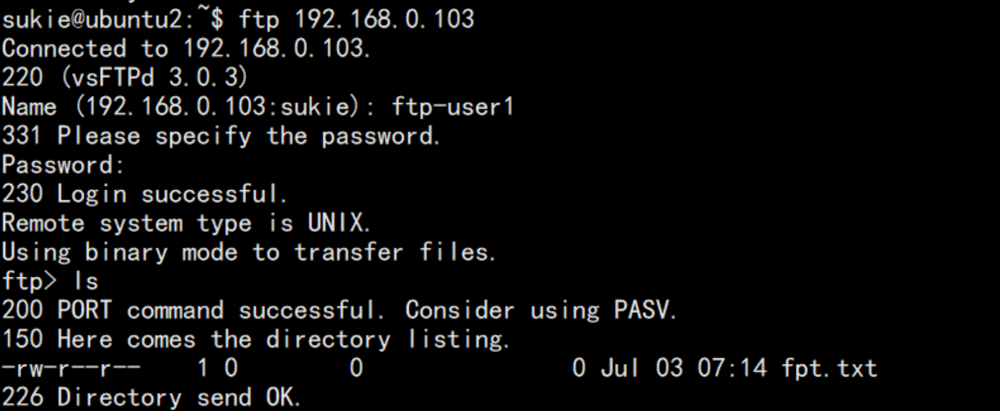
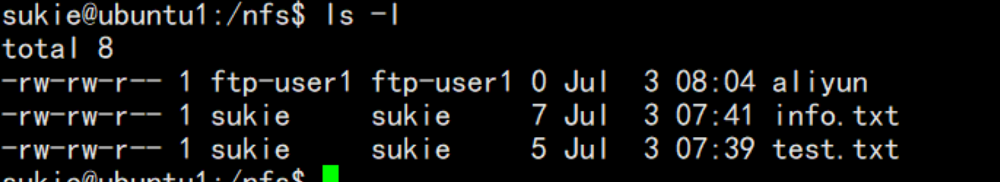
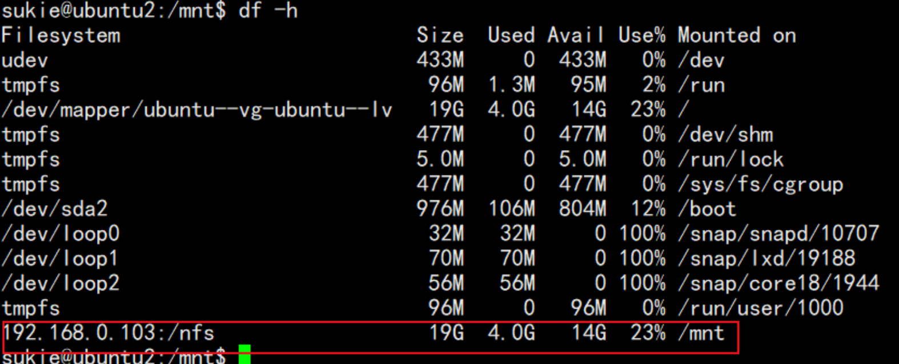
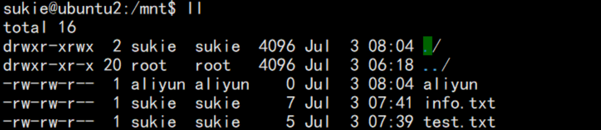
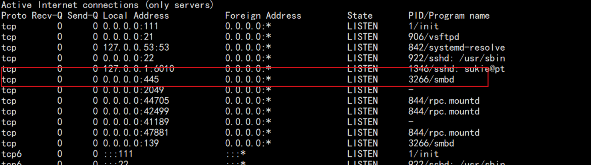
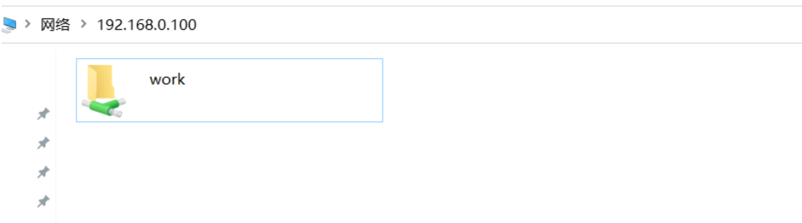
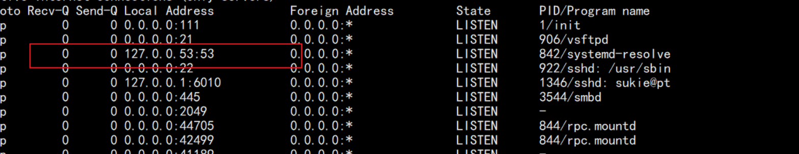

# FTP、NFS、DHCP、DNS、Samba服务器的自动安装与自动配置

## 实验环境

+ 虚拟机：**Ubuntu 20.04 server 64bit**

+ **VirtualBox 6.1.18**

+ 服务器系统：

  ​	服务器1-Server端：`192.168.0.103`

  ​	服务器2-Client端： `193.168.0.104`

## 软件环境

- `FTP`

  - 选择一款合适的`FTP`服务器软件支持所有任务要求

- `NFS`

  -  在1台Linux上配置`NFS`服务，另1台电脑上配置`NFS`客户端挂载2个权限不同的共享目录，分别对应只读访问和读写访问权限；

- `DHCP`

  - 2台虚拟机使用`Internal`网络模式连接，其中一台虚拟机上配置`DHCP`服务，另一台服务器作为`DHCP`客户端，从该`DHCP`服务器获取网络地址配置

- `Samba`

  **`smbclient`**

  - 分别查看基于 Windows 和 Linux 搭建 `SMB `共享服务包含的共享目录清单
  - 向远程共享目录上传文件和目录
  - 从远程共享目录中下载文件和目录

  - 完成`Samba`服务器配置和客户端配置连接测试

- `DNS`

  - 基于上述`Internal`网络模式连接的虚拟机实验环境，在`DHCP`服务器上配置`DNS`服务，使得另一台作为`DNS`客户端的主机可以通过该`DNS`服务器进行`DNS`查询

    

## shell脚本编程基本要求

-  自动安装与自动配置过程的启动脚本要求在本地执行

      - **提示**：配置远程目标主机的`SSH`免密`root`登录，安装脚本、配置文件可以从工作主机（执行启动脚本所在的主机）上通过`scp`或`rsync`方式拷贝或同步到远程目标主机，然后再借助`SSH`的远程命令执行功能实现远程控制安装和配置

- 假设目标系统没有配置过`root`用户免密登录，要求在自动安装脚本中包含自动配置远程`root`用户免密登录的代码

- 脚本在执行过程中，如果需要在目标主机上创建目录、创建临时文件、执行网络下载等操作需要判断执行是否成功，并进行必要的异常处理（例如：`apt-get update`失败，则退出脚本执行，并将友好错误信息打印在控制台上。临时目录不存在，则自动创建该临时目录）

- 所有服务的配置文件、临时目录需设置正确的目录和文件归属和权限位，禁止使用**777**这种偷懒的权限位设置

- 减少不必要的安装过程中的人机交互输入，尽可能全部通过脚本的方式完成选项设置和交互式问题输入等

-  目标环境相关参数应使用独立的配置文件或配置脚本（在主调脚本中引用配置脚本）

	- 目标服务器`IP`
	- 目标服务器`SSH`服务的端口
	- 目标服务器上使用的用户名
	- 目标服务器上用于临时存储安装脚本、配置文件的临时目录路径

  ## 其他要求

- 撰写实验报告，证明具体完成了哪些任务要求

- 所有脚本代码、配置文件均应包含在文件夹中

- 脚本应在纯净未配置任何目标服务的系统和已完全配置好所有目标服务的系统2种典型测试用例条件下均能测试通过

  - 对于在目标系统上已完成配置的服务，允许用本地的配置文件去覆盖远程已有的配置文件，但在执行**覆盖**操作之前应对远程已有的配置文件进行**妥善**备份

  

## 实验过程

### 一、FTP安装

思路：	

	Server端安装`vsftp`服务，Client端去访问服务端的`ftp`；

安装脚本如下：

```shell
#!/bin/bash
apt install vsftpd -y
if [ $? -eq 0 ];then
	echo "ftp install success!"
else
	echo "apt install fail,please check apt源"
	exit
fi

tee -a /etc/vsftpd.conf <<< "userlist_deny=NO"
tee -a /etc/vsftpd.conf <<< "userlist_enable=YES"
tee -a /etc/vsftpd.conf <<< "userlist_file=/etc/allowed_users"
tee -a /etc/vsftpd.conf <<< "local_enable=YES"
tee -a /etc/vsftpd.conf <<< "write_enable=YES"
tee -a /etc/vsftpd.conf <<< "pasv_promiscuous=YES"
tee -a /etc/vsftpd.conf <<< "listen=YES"
tee -a /etc/vsftpd.conf <<< "listen_ipv6=No"

/etc/init.d/vsftpd start

if [ $? -eq 0 ];the
	echo "ftp 启动成功"
else
	echo "ftp 启动失败，请检查配置文件"
	exit
fi

useradd -m ftp-user1
echo ftp-user1:123456 | chpasswd
touch /home/ftp-user1/fpt.txt
touch  /etc/allowed_users
tee -a /etc/allowed_users <<< "ftp-user1"

echo "安装完成，请使用客户端登入ftp"
```

使用客户端服务访问`ftp 192.168.0.103`,输入用户名和密码：`ftp-user1`



成功访问到`ftp`，`ftp`安装成功。

### 二、NFS安装

`NFS` 即网络文件系统（Network File-System），可以通过网络让不同机器、不同系统之间可以实现文件共享。通过` NFS`，可以访问远程共享目录，就像访问本地磁盘一样。`NFS `只是一种文件系统，本身并没有传输功能，是基于 `RPC`（远程过程调用）协议实现的，采用` C/S `架构。

在Server端安装：`nfs-kernel-server`

在Client端安装：`nfs-common `

Server端安装脚本如下：

```shell
#!/bin/bash
apt-get install nfs-kernel-server -y
if [ $? -eq 0 ];then
	echo "nft-server install success!"
else
	echo "apt install fail,please check apt源"
	exit
fi
/bin/bash -c 'echo "/nfs *(rw,sync,no_root_squash)" >> /etc/exports'
mkdir /nfs
chmod -R 755 /nfs
chown -R sukie:sukie /nfs/
chmod o+x /nfs
/etc/init.d/nfs-kernel-server start

if [ $? -eq 0 ];then
	echo "ftp 启动成功"
else
	echo "ftp 启动失败，请检查配置文件"
	exit
fi
echo "test" >> /nfs/test.txt
```

Client端安装脚本：

```shell
#!/bin/bash
apt-get install nfs-common  -y
if [ $? -eq 0 ];then
	echo "nft-common install success!"
else
	echo "apt install fail,please check apt源"
	exit
fi

mount -t nfs 192.168.0.103:/nfs /mnt -o nolock

if [ $? -eq 0 ];then
	echo "目录挂载成功!"
else
	echo "目录挂载失败"
	exit
fi

```

Server端目录信息：



Client端磁盘挂载：



Client端建立文件及目录信息：




### 三、DHCP安装

安装脚本如下：

```shell
#!/bin/bash
apt-get install  isc-dhcp-server -y
if [ $? -eq 0 ];then
	echo "dhcp install success!"
else
	echo "apt install fail,please check apt源"
	exit
fi

tee -a /etc/dhcp/dhcpd.conf <<< “subnet 10.0.0.0 netmask 255.255.255.0 {”
tee -a /etc/dhcp/dhcpd.conf <<< “range 10.0.0.10 10.0.0.100;”
tee -a /etc/dhcp/dhcpd.conf <<< “option domain-name-servers 202.206.192.33, 223.5.5.5;”
tee -a /etc/dhcp/dhcpd.conf <<< “option domain-name "mylab.com";”
tee -a /etc/dhcp/dhcpd.conf <<< “option subnet-mask 255.255.255.0;”
tee -a /etc/dhcp/dhcpd.conf <<< “option routers 10.0.0.1;”
tee -a /etc/dhcp/dhcpd.conf <<< “option broadcast-address 10.0.0.255;”
tee -a /etc/dhcp/dhcpd.conf<<< “default-lease-time 600;”
tee -a /etc/dhcp/dhcpd.conf <<< “max-lease-time 7200;”
tee -a /etc/dhcp/dhcpd.conf <<< }

/etc/init.d/isc-dhcp-server start

if [ $? -eq 0 ];then
	echo "dhcp 启动成功"
else
	echo "dhcp启动失败，请检查配置文件"
	exit
fi

```


### 四、Samba安装

在主机端安装`Samba`服务

安装脚本如下

```shell
#!/bin/bash
apt-get install  samba -y
if [ $? -eq 0 ];then
	echo "sambainstall success!"
else
	echo "apt install fail,please check apt源"
	exit
fi

cp /etc/samba/smb.conf  /etc/samba/smb.conf.bak

touch /etc/samba/smb.conf

tee -a /etc/samba/smb.conf <<< "[ work ]"

tee -a /etc/samba/smb.conf <<< "comment = samba home directory "

tee -a /etc/samba/smb.conf <<< " path = /home/ftp-user1/"

tee -a /etc/samba/smb.conf <<< " public = yes "

tee -a /etc/samba/smb.conf <<< "browseable = yes "

tee -a /etc/samba/smb.conf <<< "writeable = yes "

tee -a /etc/samba/smb.conf <<< " read only = no "

tee -a /etc/samba/smb.conf <<< "valid users = lsh "

tee -a /etc/samba/smb.conf <<< "create mask = 0755 "

tee -a /etc/samba/smb.conf <<< " directory mask = 0755"

tee -a /etc/samba/smb.conf <<< " available = yes "

/etc/init.d/smbd start

if [ $? -eq 0 ];then
	echo "dhcp 启动成功"
else
	echo "dhcp启动失败，请检查配置文件"
	exit
fi
```

查看服务状态：



使用`Windows`访问服务




### 五、DNS安装

在服务端安装`bind9`

脚本内容如下：

```shell
#!/bin/bash
apt-get install  bind9 -y
if [ $? -eq 0 ];then
	echo "bind9 install success!"
else
	echo "apt install fail,please check apt源"
	exit
fi
tee -a /etc/bind/named.conf.local <<< "zone "mag.com"{"

tee -a /etc/bind/named.conf.local <<< "type master;"

tee -a /etc/bind/named.conf.local <<< "file "db.mag.com";"

tee -a /etc/bind/named.conf.local <<< "};"

tee -a /etc/bind/named.conf.local <<< "zone "git.com"{"

tee -a /etc/bind/named.conf.local <<< "type master;"

tee -a /etc/bind/named.conf.local <<< "file "db.git.com";"

tee -a /etc/bind/named.conf.local <<< "};"

cp /etc/bind/db.local /var/cache/bind/db.mag.com cp /etc/bind/db.local /var/cache/bind/db.git.com

tee -a /var/cache/bind/db.git.com <<< "@ IN A 192.168.0.103"

sed -i 's/0.0.0.0/8.8.8.8/g' /etc/bind/named.conf.options

 /etc/init.d/bind9 restart

if [ $? -eq 0 ];then
	echo "dns启动成功"
else
	echo "dns启动失败，请检查配置文件"
	exit
fi
```




## 实验完成度

实验报告中请记录在`NFS`客户端上看到的：

- 你通过`NFS`客户端在`NFS`共享目录中新建的目录、创建的文件的属主、权限信息上述共享目录中文件、子目录的属主、权限信息和在`NFS`服务器端上查看到的信息一样吗？

  - 不一样

- 无论是否一致，请给出你查到的资料是如何讲解`NFS`目录中的属主和属主组信息应该如何正确解读

  - nfs挂载后文件属性的变更
    文件的 **属主属性** 其实是文件内容的一部分，应该会占据文件的大小字节数。
    例子证明：

    对于A机器上`proxmox:/etc-asterisk# more /etc/exports/etc-asterisk *(rw,sync)`

    的文件系统。

    1.虽然在A机器上属于用户`user5(uid=505,gid=505)`，但是`nfs`到了B机器上后，用`ls -l`查看属主就会变成 `505:505`的属主了，B机器上没有`user5`这个用户，只能用数字代替。

    2.如果B机器上有`asterisk(uid=100,gid=101)`这个用户，而A机器上却没有`asterisk`用户，如果在A机器上用 `proxmox:/etc-asterisk# chown -R 100:101 `. 

    结果在B机器上`ls -l `查看，发现所以文件的属主都编程B机器上的`asterisk`用户了。 所以这个现象说明：文件属主是文件内容的一部分，而且linux认识文件的属主，只是根据文件的属主id号去匹配`/etc/passwd`中的用户数的。

    【可以参考】[[linux nfs软连接、文件属主的变更]](https://www.cnblogs.com/voiphudong/p/3317486.html)
    
    

- 在客户端或`NFS`服务器上抓包分析使用`NFS`协议时的远程文件下载、上传、移动、删除等操作是否是明文？远程的文件传输数据流是否可以被恢复出完整的传输文件？

  - 是明文，所以安全性较差，一般只能在局域网中使用。
  - 不可以
  - 【可以参考】[NFS具体描述](https://blog.csdn.net/weixin_33971205/article/details/93638670)


## 实验问题回答

- #### 	shell脚本编程基本要求——全部完成

- #### 	其他要求——全部完成

- #### 遇到问题：

  nfsv4 挂载文件，由于属组在本地不存在，导致文件属组属主为nobody的问题
  
  - 成功解决
  - 可以参考[文件属组属主为nobody的问题](https://www.jianshu.com/p/4d7cbc76805f)
  
  

## 参考链接

- [FTP Server from Ubuntu Official Documentation ](https://ubuntu.com/server/docs)

- [Samba](https://help.ubuntu.com/community/Samba)

- [Samba Client Guide](https://help.ubuntu.com/community/Samba/SambaClientGuide)

- [Setting up Samba as a Standalone Server](https://wiki.samba.org/index.php/Setting_up_Samba_as_a_Standalone_Server)


